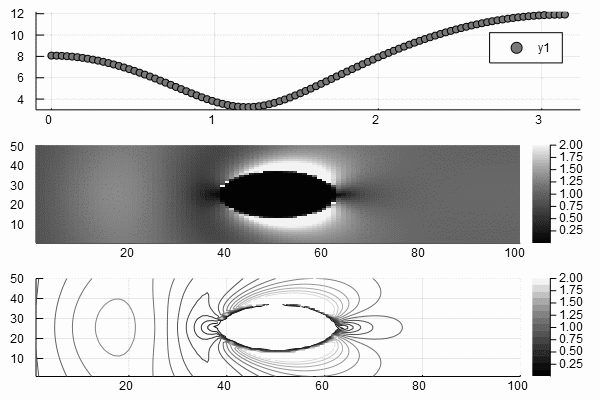

# BEAST

Boundary Element Analysis and Simulation Toolkit

[](https://travis-ci.org/krcools/BEAST.jl)
[](https://coveralls.io/github/krcools/BEAST.jl?branch=master)
[](http://codecov.io/github/krcools/BEAST.jl?branch=master)
[](https://krcools.github.io/BEAST.jl/latest/)

## Introduction

This package contains common basis functions and assembly routines for the implementation of
boundary element methods. Examples are included for the 2D and 3D Helmholtz equations and for
the 3D Maxwell equations.

Support for the space-time Galerkin based solution of time domain integral equations is in
place for the 3D Helmholtz and Maxwell equations.

## Installation

Installing `BEAST` is done by entering the package manager (enter `]` at the julia REPL) and issuing:

```
pkg>add BEAST
```

To run the examples, the following steps are required in addition:

```
pkg> add CompScienceMeshes # For the creation of scatterer geometries
pkg> add Plots             # For visualising the results
pkg> add GR                # Other Plots compatible back-ends can be chosen
```

Examples can be run by:

```
julia>using BEAST
julia>d = dirname(pathof(BEAST))
julia>include(joinpath(d,"../examples/efie.jl"))
```

## Hello World

To solve scattering of a time harmonic electromagnetic plane wave by a perfectly conducting
sphere:

```julia
using CompScienceMeshes, BEAST

Γ = readmesh(joinpath(dirname(pathof(BEAST)),"../examples/sphere2.in"))
X = raviartthomas(Γ)

t = Maxwell3D.singlelayer(wavenumber=1.0)
E = Maxwell3D.planewave(direction=ẑ, polarization=x̂, wavenumber=1.0)
e = (n × E) × n

@hilbertspace j
@hilbertspace k
efie = @discretise t[k,j]==e[k]  j∈X k∈X
u = gmres(efie)
```


## Features

- General framework allowing to easily add support for more kernels, finite element spaces, and excitations.
- Assembly routines that take in symbolic representations of the defining bilinear form. Support for block systems and finite element spaces defined in terms of direct products or tensor products of atomic spaces.
- LU and iterative solution of the resulting system.
- Computation of secondary quantities of interest such as the near field and the limiting far field.
- Support for space-time Galerkin and convolution quadrature approaches to the solution of time domain boundary integral equations.
- Implementation of Lagrange zeroth and first order space, Raviart-Thomas, Brezzi-Douglas-Marini, and Buffa-Christianssen vector elemenents.
