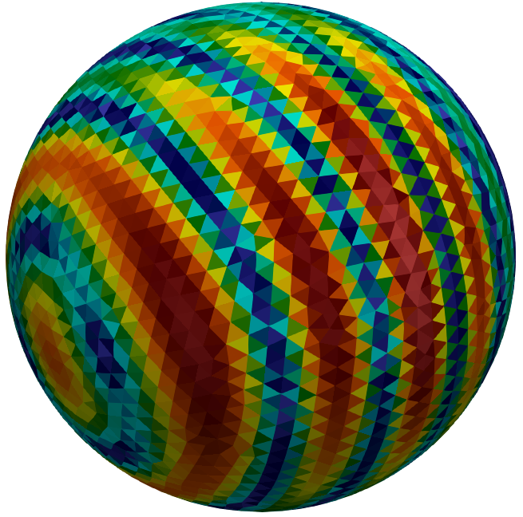
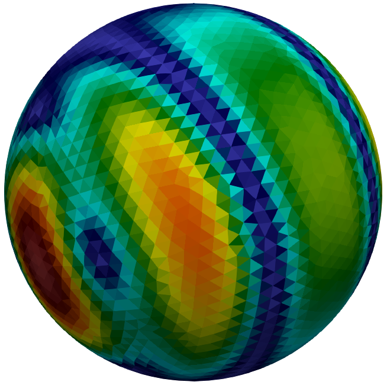

<picture>
  <source media="(prefers-color-scheme: dark)" srcset="docs/src/assets/logo_README_white.svg" height="170">
  <source media="(prefers-color-scheme: light)" srcset="docs/src/assets/logo_README.svg" height="170">
  
</picture>


[](https://krcools.github.io/BEAST.jl/stable/)
[](https://github.com/krcools/BEAST.jl/blob/master/LICENSE)
[](https://github.com/krcools/BEAST.jl/actions/workflows/CI.yml)
[](http://codecov.io/github/krcools/BEAST.jl?branch=master)
[](https://zenodo.org/badge/latestdoi/87720391)


## Introduction

This Julia package, the *boundary element analysis and simulation toolkit (BEAST)*, provides routines to convert integral and differential equations to linear systems of equations
via the boundary element method (BEM) and the finite element method (FEM). 
To this end, the (Petrov-) **Galerkin method** is employed.

Currently, the focus is on equations encountered in **classical electromagnetism**, where frequency and time domain equations are covered.
Several operators, basis functions, and geometry representations are implemented.


## Documentation

- Documentation for the [latest stable version](https://krcools.github.io/BEAST.jl/stable/).
- Documentation for the [development version](https://krcools.github.io/BEAST.jl/dev/).


## Hello World

To solve scattering of a time-harmonic electromagnetic plane wave by a perfectly conducting sphere:

```julia
using CompScienceMeshes
using BEAST

# --- basis functions
Γ  = meshsphere(1.0, 2.5)   # triangulate sphere of radius one
RT = raviartthomas(Γ)       # define basis functions

# --- operators & excitation
𝑇 = Maxwell3D.singlelayer(wavenumber=2.0)                             # integral operator
𝐸 = Maxwell3D.planewave(direction=x̂, polarization=ẑ, wavenumber=2.0)  # excitation
𝑒 = (n × 𝐸) × n # tangential part

# --- compute the RHS and system matrix
e = assemble(𝑒, RT)         # assemble RHS
T = assemble(𝑇, RT, RT)     # assemble system matrix

# --- solve
u = T \ -e

# ... post processing ...
```
<p align="center">
  
  &nbsp;&nbsp;&nbsp;&nbsp;&nbsp;&nbsp;&nbsp;&nbsp;&nbsp;&nbsp;&nbsp;&nbsp;&nbsp;&nbsp;&nbsp;&nbsp;
  
</p>
